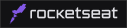
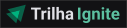
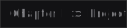

#### Rocketseat's Ignite Path 2022

# Chapter I > Project I

Educational React project developed during the lessons of the new <i><a href="https://rocketseat.com.br/" target="_new">Rocketseat</a>'s <strong>Ignite Path 2022</strong></i>.

# Description

A fictional blog post designed on <strong>Figma</strong>, created with <strong>Vite</strong>, with all its main components and properties typed with <strong>TypeScript</strong>.

# Techs

  
  
  
  
  
  
  

